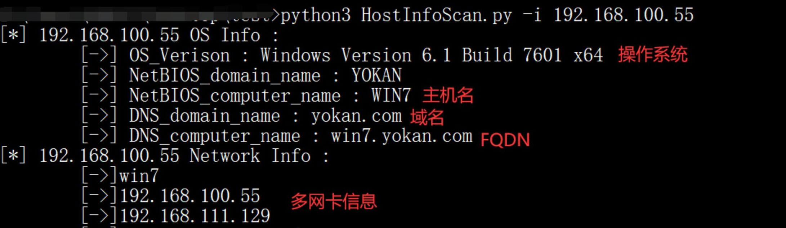

# HostInfoScan
红队小工具 | 利用DCERPC协议，无需认证获取Windows机器主机信息和多网卡信息
## 简介
分析和部分代码参考了倾旋师傅的[文章](https://payloads.online/archivers/2020-07-16/1/)

**本工具主要用于探测内网中Windows机器的操作系统信息、域名、主机名以及多网信息，可以辅助红队快速定位多网卡主机，以及判断机器是否在域内。**

**优点：
无需认证，只要目标的135端口开放即可获得信息**


## 效果
域内机器：


工作组机器：


## 使用
```
usage: HostInfoScan.py [-h] -i IP [-t THREADS] [-a ATTACK] [-o OUTPUT]

optional arguments:
  -h, --help            show this help message and exit
  -i IP, --ip IP        IP Address,expample:192.168.0.1, 192.168.0.1-100, 192.168.0.1/24, ip.txt
  -t THREADS, --threads THREADS
                        threads, default 20
  -a ATTACK, --attack ATTACK
                        choose attack: 0:all 1:OSInfo 2:NetWorkInfo, defualt 0
  -o OUTPUT, --output OUTPUT
                        Output result, default: log.txt
```

常规使用
```
python3 HostInfoScan.py -i 192.168.0.1/24
python3 HostInfoScan.py -i 192.168.0.1/24 -a 1     #只进行主机信息探测（操作系统、域名、主机名）
python3 HostInfoScan.py -i 192.168.0.1/24 -a 2     #只进行多网卡信息探测
python3 HostInfoScan.py -i 192.168.0.1/24 -a 0 -t 5 -o result.txt
```
ip支持多种输入形式
```
python3 HostInfoScan.py -i 192.168.0.100
python3 HostInfoScan.py -i 192.168.0.1-50
python3 HostInfoScan.py -i 192.168.0.1/24
python3 HostInfoScan.py -i ip.txt
```

## 免责声明
本工具仅面向合法授权的企业安全建设行为，如您需要测试本工具的可用性，请自行搭建靶机环境。

在使用本工具进行检测时，您应确保该行为符合当地的法律法规，并且已经取得了足够的授权。请勿对非授权目标进行扫描。

如您在使用本工具的过程中存在任何非法行为，您需自行承担相应后果，我们将不承担任何法律及连带责任。

在安装并使用本工具前，请您务必审慎阅读、充分理解各条款内容。 除非您已充分阅读、完全理解并接受本协议所有条款，否则，请您不要安装并使用本工具。您的使用行为或者您以其他任何明示或者默示方式表示接受本协议的，即视为您已阅读并同意本协议的约束。
